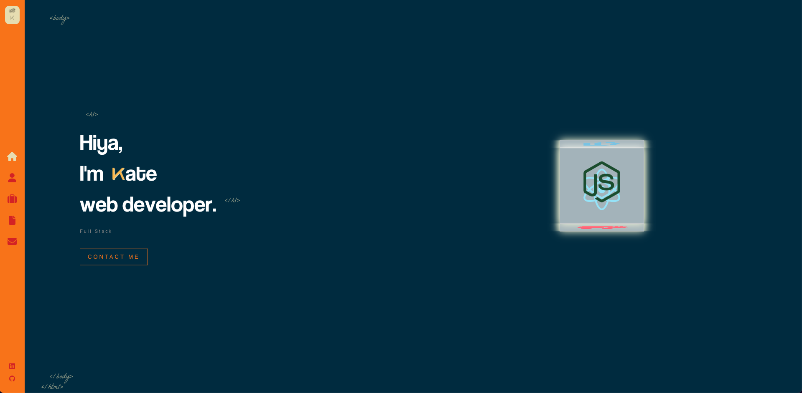
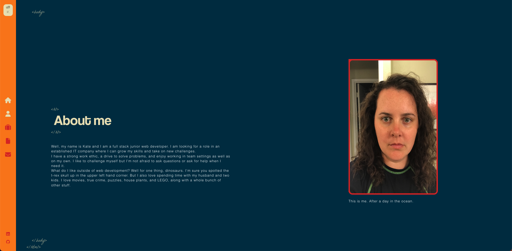
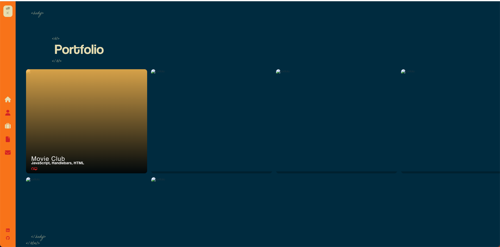
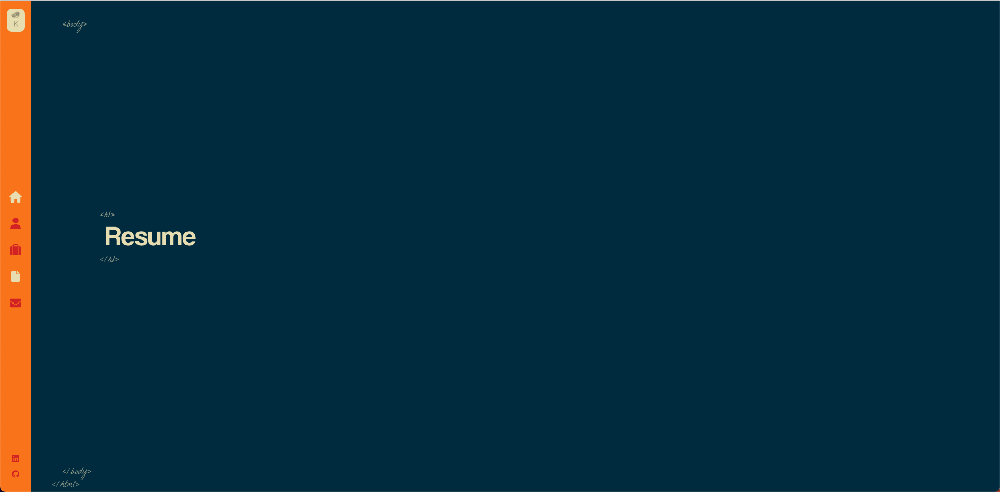
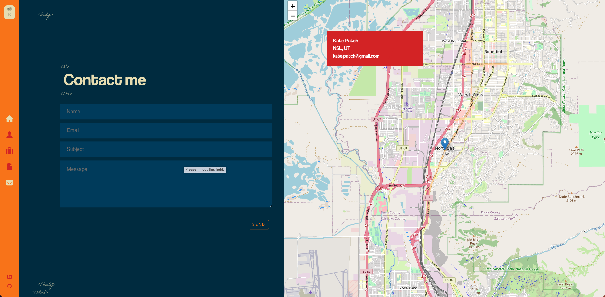

# React Portfolio

This repository holds my professional portfolio.

## Preview

Deployed via Github [Pages](https://katepatch.github.io/React-Portfolio/)

### Screenshots

### Homepage

### About Me

### Portfolio

### Resume

### Contact Me

## Installation

To install this, clone the repository.  Install the necessary packages by typing `npm i` into the command line.  In the terminal command line run `npm run start` to open this on your local host.

## Questions

For questions about this project or others you can reach me via: 
Github: [katepatch](https://github.com/katepatch) 
or email kate.epatch@gmail.com
